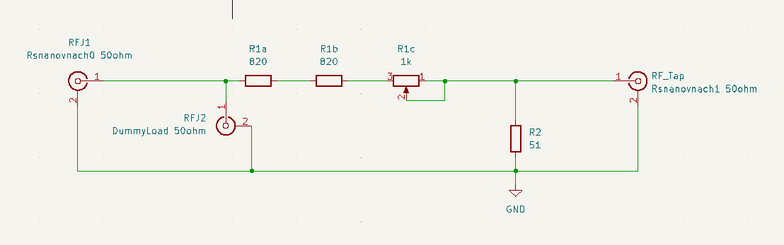
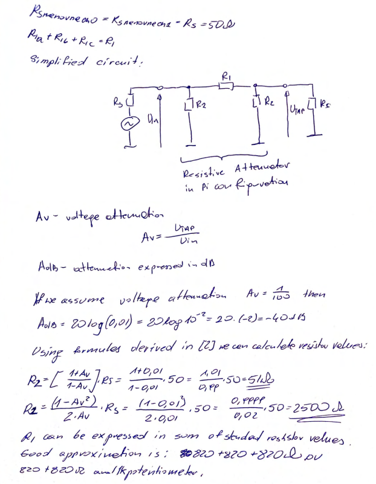
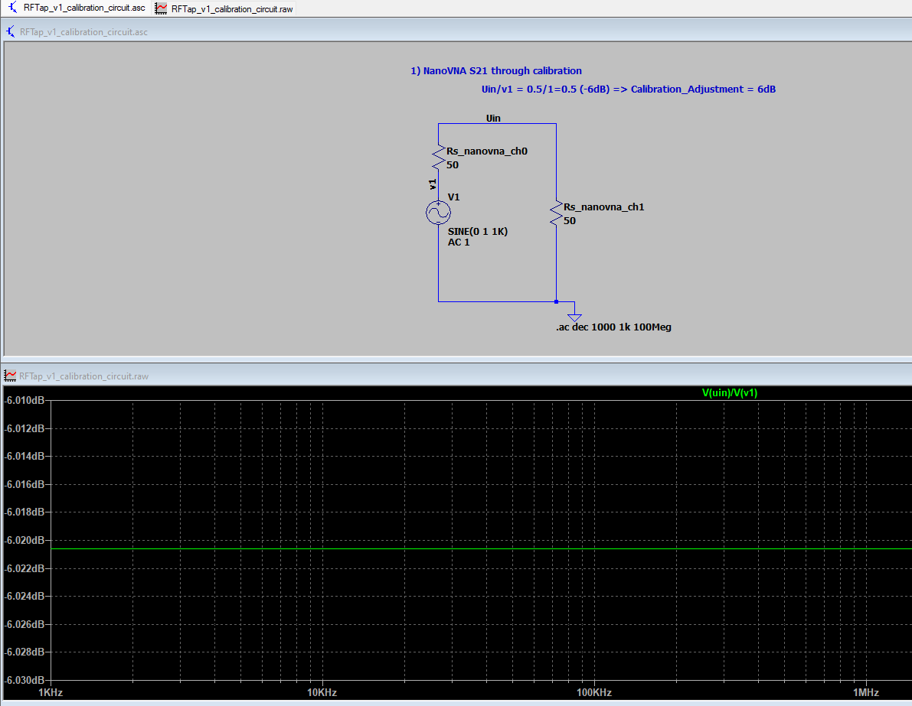
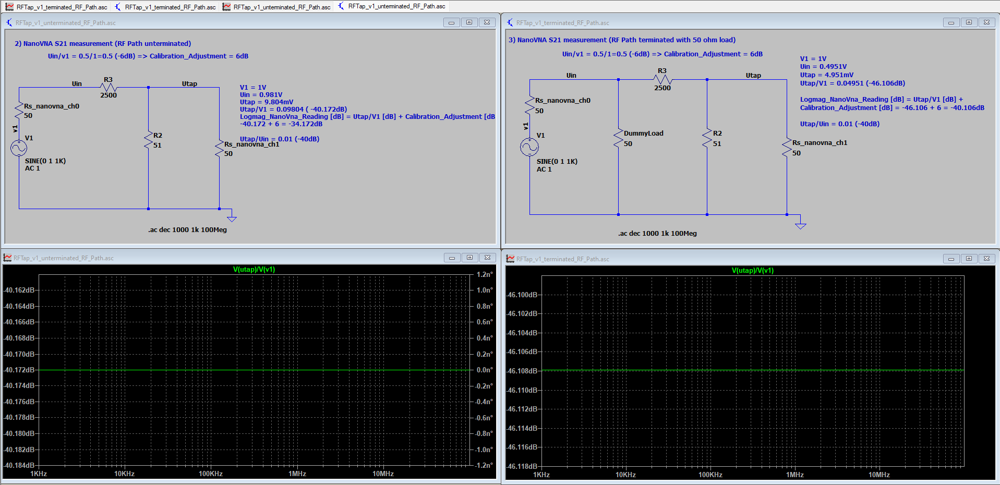
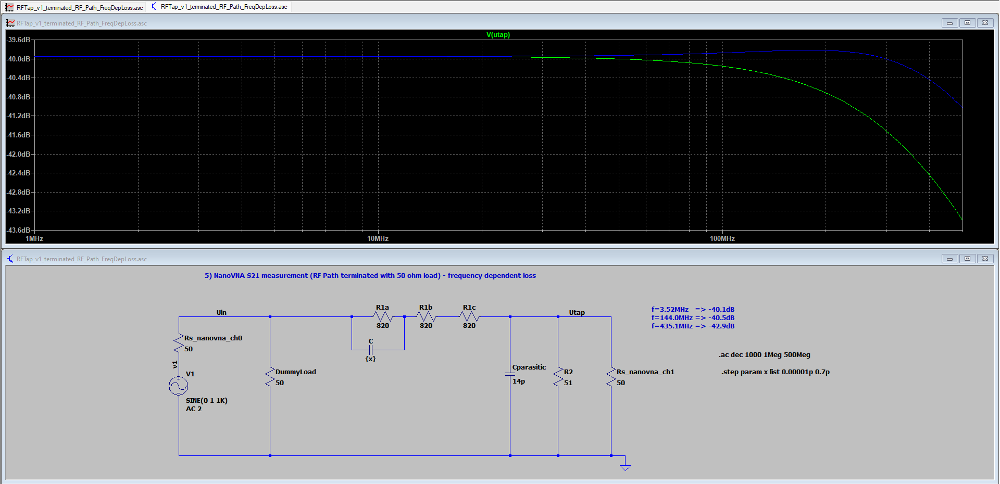
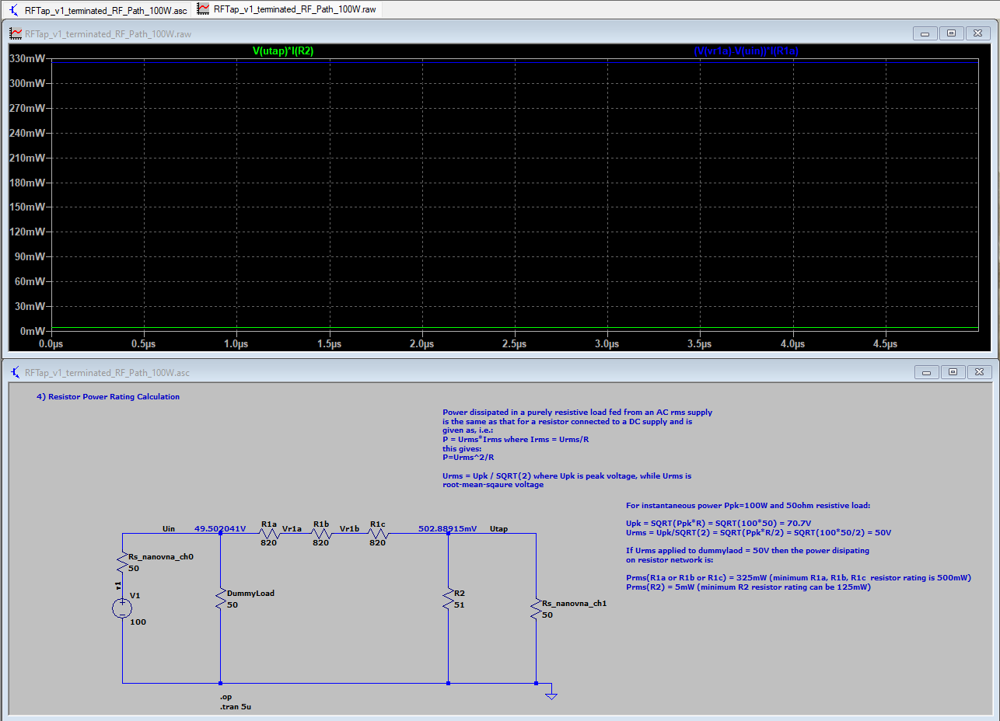
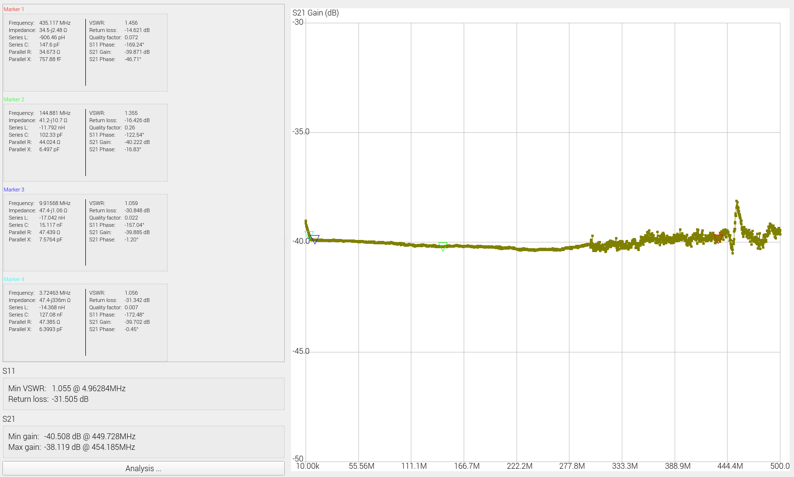

## RF Tap

 

## Credits

* Wes Hayward W7ZOI and Bob Larkin W7PUA for great base design of RF Tap described in QST June 2001 issue.
* Barry L. Dorr for detailed analysis of resistive pi attenuator design.
* Fesz (owner of Fesz Electronics youtube channel) for great hints regarding how to match ltspie simulations to NanoVNA measurements - You rock Fesz!!!

## Design Overview
RF Tap is a device used to extract or monitor radio frequency (RF) signals from a transmission line without significantly disturbing the original signal. The RF signal at Tap output is attenuated to a level that is safe for measurement equipment such as oscilloscope. In case of this particular design attenuation is fixed to -40dB (voltage at RFTap output is x100 lower then one, which is present at the transmission path). All three RF Tap terminals have 50ohm impedance.
This design is based on work by Wes Hayward W7ZOI and Bob Larkin W7PUA described in [1]. The only modification made here is the use of precission potentiometer instead of one of the resistors used to attenuate RF signal for precise attenuation level adjustment.

Circuit Schematics:

Resistors R1a, R1b and R1c shall be 500mW rated. R2 can be 125mW rated. Please note that if you do not terminate RF path with 50ohm dummy load or antenna, power (Prms) dissipated on one of R1 resistors goes up to 1.3W!

Calculations of resistor values for given level of attenuation:

## Circuit Simulations

To be able to relate simulation results to NanoVNA measurements the first step is to establish measurement correction, which Nanovna calculates as part of calibration process.

As can be seen from the results above, in our case the calibration correction is +6dB, which is added to all measurement results.

Now we can simulate RF Tap attenuation levels for unterminated and terminated with 50ohm resistor RF Paths:

In case of unterminated RF Path attenuation of RF Tap is equal -34dB and when the RF Path is terminated with 50ohm load attenuation increases to -40dB. 

As can be seen in Measurements section simulation results match perfectly actual measurements.

Simulation of the impact of parasitic capacitance present in the circuit and effect of corrective capacitance added in parallel to resistor R1 can be found below:

Finally, calculations of resistor power ratings is given below (simulation run for peak power value of 100W):

## Measurements

### Device frequency response measured between one of RF path ends and RF tap output (another RF path end is terminated with 50ohm dummy load)

Picture to the right shows RF Tap's S21 curve when capaitor C is present. 
Picture to the left shows Tap's S21 curve when capacitor C is not present. 
The cap C reduces attenuation for signals above 144MHz.

### VSWR measured at one of RF path ends (another RF path end is terminated with 50ohm dummy load)

Picture to the right shows RF Tap's VSWR curve measured at RF input for device with capaitor C.
Picture to the left shows Tap's VSWR curve measured at RF input for device with no capacitor C.
In both cases other end of RF path is terminated with 50 ohm dummy load.
It can be observed that while capacitor C improves Tap's frequency response seen from Tap output (attenuation is closer to -40dB accross enntire band) it also slightly increases VSWR measured at one of RF path ends.

### Insertion loss measured at RF path ends (RF Tap termination does not impact measurements)

Insertion loss caused by RF Tap is not greater then -0.5dB accross entire band (DC-500MHz). Presence of Cap does not impact insertion loss level in any significant way.
RF Tap termination does not impact measurement results i.e. insertion loss is the same for RF Tap output terminated with 50ohm resistor and when RF Tap is left open.

## References

[1] "Simple RF-Power Measurement", QST June 2001 by Wes Hayward W7ZOI and Bob Larkin W7PUA

[2] "Ten Essential Skills for Electrical Engineers" by Barry L. Dorr, Willey 2014, Chapter: "How to Design Resistive Circuits"